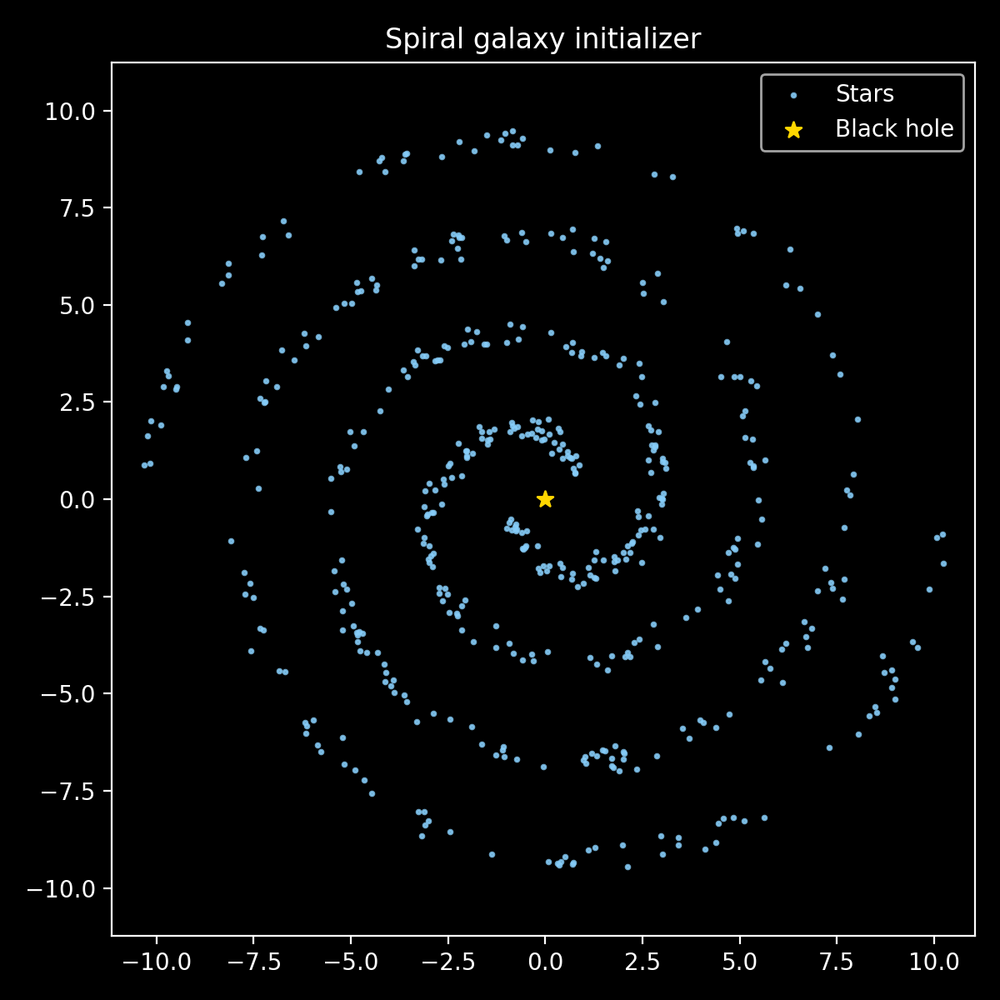

# GravityWell

Interactive N-body playground with a Barnes–Hut integrator and pyglet renderer.

## Setup and running

1. Create a virtual environment (recommended) and install dependencies:
   ```bash
   python -m venv .venv
   source .venv/bin/activate
   pip install -r requirements.txt
   ```
2. Launch an example spiral galaxy from the repository root:
   ```bash
   python - <<'PY'
   from src.simulation.initializers import generate_spiral_galaxy
   from src.simulation.state import SimulationState
   from src.visualization.renderer import Renderer
   from src.visualization.app import SimulationApp

   bodies = generate_spiral_galaxy(num_arms=2, stars_per_arm=300)
   state = SimulationState(bodies, dt=0.01, gravitational_constant=1.0)
   app = SimulationApp(state, Renderer())
   app.start()
   PY
   ```
   The pyglet window will open with trails, live energy plots, and on-screen controls.

> **Tip:** When running on headless environments, configure a virtual display (e.g., `Xvfb`) before launching pyglet.

## Controls

Keyboard shortcuts (handled by `SimulationApp`):
- **Space** — pause/resume.
- **Arrow Up / Down** — increase/decrease the integration timestep (`dt`) with clamping.
- **Arrow Right / Left** — increase/decrease the gravitational constant (`G`) with clamping.

Mouse and UI controls:
- Click the on-screen buttons to pause/resume, adjust `dt`, adjust `G`, or drop a supermassive black hole at the current viewport center.
- Left-click anywhere on the canvas to insert a stationary supermassive black hole at that location.

## Featured scenarios

- **Single spiral galaxy** — `generate_spiral_galaxy` builds a rotationally supported disk with a central black hole, Gaussian arm jitter, and velocity dispersion to keep the disk stable. The example below shows the initializer output before evolution.
  
  

- **Colliding galaxies** — `load_intersecting_spirals` creates two offset spiral galaxies with configurable separation, approach speed, and impact parameter for dramatic fly-bys or mergers.
  
  

## Performance and stability tips

- **Barnes–Hut opening angle (`theta`)** — lower values (e.g., 0.3) increase accuracy at the cost of more quadtree traversal; higher values (e.g., 0.8–1.0) run faster but can smear fine-grained interactions.
- **Timestep (`dt`) safety** — the leapfrog integrator is symplectic but still sensitive to very large steps. Use the arrow keys or UI buttons to tweak `dt`; values are clamped between `min_dt` and `max_dt` to reduce blow-ups.
- **Softening** — small `softening` values reduce force singularities if you add extremely massive black holes or pack stars densely.
- **Renderer workload** — lowering `trail_length`, `energy_samples`, or `window_size` in `Renderer` reduces GPU/CPU load when running on constrained machines.

## Architecture notes

- **Simulation core** — `simulation.engine` provides `Body`, Barnes–Hut quadtree construction (`QuadNode`), and a leapfrog integrator (`leapfrog_step`) that advances all bodies using computed accelerations.
- **State and runtime controls** — `SimulationState` wraps the body list with runtime-tunable parameters (`dt`, `G`, `theta`, `softening`) and helper methods to pause, clamp/scaling values, and inject new black holes mid-run.
- **Rendering** — `Renderer` draws particles with GL points, maintains motion trails, normalizes world coordinates to the viewport, and overlays kinetic/potential energy histories plus text annotations.
- **Input and UI** — `SimulationApp` wires window events to `SimulationState` mutations and delegates button drawing/interaction to `ControlPanel` and `ControlButton`, ensuring mouse clicks are routed before spawning new bodies.

